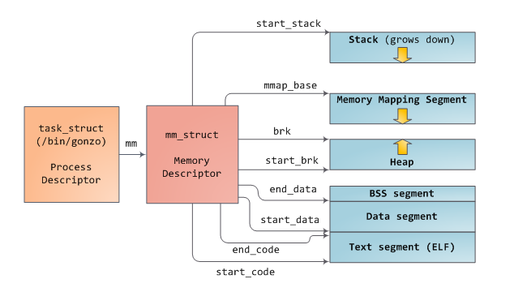
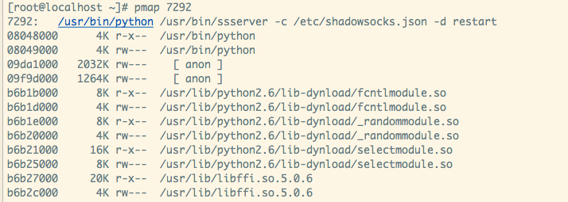
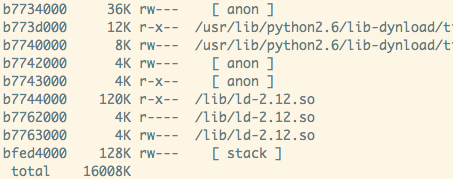

# kerlinux内存管理

## Linux虚拟地址空间布局


从进程的数据结构来看：




整个虚拟地址空间都可以看做一个映射，对应着有文件的（比如BSS，Data, Text)成为文件映射，没有对应的文件映射的成为匿名映射。

> note： 不论对于文件映射还是虚拟内存到物理内存的映射都是采用的写时复制技术，只有真正产生了访问了，触发了缺页异常才会加载到内存当中。所以对于一个100M的可执行文件，这个可执行文件顺便调用了外部200M的so库，它启动后在内存中的占用显然不300M，不然就很sb了。

参考： 

[Linux虚拟地址空间布局](http://www.cnblogs.com/clover-toeic/p/3754433.html)

[linux内核内存管理](http://luodw.cc/2016/02/17/linux-memory)


## Linux虚拟地址到物理地址的映射（页表）

参考：

[Linux分页机制之概述--Linux内存管理](http://blog.csdn.net/gatieme/article/details/52402861)

[腾讯后台开发工程师谈：Linux内存管理](https://www.jianshu.com/p/ad66092e611b)

1. linux kenel中会维护一个页表映射，这个映射是通过5级寻址来实现的。（为什么不使用数组，而是使用多级寻址，见上面的参考文章。）
2. 对于计算机来说，寻址是非常普遍的操作，这对cpu来说是庞大的开销。于是进化出了专业针对虚拟地址到物理地址转换的硬件单元 MMU, TLB.
3. TLB是为了保存虚拟地址和物理地址映射关系的缓存，对于经常访问的虚拟地址，没有必要每次都重新计算。


## top命令含义

> PID USER PR NI VIRT RES SHR S %CPU %MEM TIME+ COMMAND
>
> 2120 kgregory 20 0 4373m 15m 7152 S 0 0.2 0:00.10 java
>
> - VIRT is the virtual memory space: the sum of everything in the virtual memory map (see below). It is largely meaningless, except when it isn't (see below).
> - RES is the resident set size: the number of pages that are currently resident in RAM. In almost all cases, this is the only number that you should use when saying "too big." But it's still not a very good number, especially when talking about Java.
> - SHR is the amount of resident memory that is shared with other processes. For a Java process, this is typically limited to shared libraries and memory-mapped JARfiles. In this example, I only had one Java process running, so I suspect that the 7k is a result of libraries used by the OS.
> - SWAP isn't turned on by default, and isn't shown here. It indicates the amount of virtual memory that is currently resident on disk, whether or not it's actually in the swap space. The OS is very good about keeping active pages in RAM, and the only cures for swapping are (1) buy more memory, or (2) reduce the number of processes, so it's best to ignore this number. 


从vpn-host上随便找个程序：



从上面可以看出：

- 所有的动态库在虚拟内存中都有映射。

- 对于fcntlmodule来说，存在两个项。两个项目相加即为fntlmodule.so的真实大小

  -r-xr-xr-x 1 root root 14K  8月 18 2016 /usr/lib/python2.6/lib-dynload/fcntlmodule.so

top的结果：


pmap中所有的值是否等于VIRT呢? 验证结果是相等的



## GLIBC malloc 实现分析

Malloc 主要三种方式分配内存

*1. glibc中自带的缓存，只针对较小的内存分配*

*2. 通过扩展堆顶指针来扩大堆大小*

```c
int brk( const void *addr )   // 用于扩展堆空间的大小
void* sbrk ( intptr_t incr ); // 用户分配内存，注意这个时候只是分配了一个“映射关系”，只有进程真正写入的时候，这块内存才真真的分配。
```

*3. 通过mmap来映射一块内存*

```c
void *mmap(void *addr, size_t length, int prot, int flags, int fd, off_t offset);
int munmap(void *addr, size_t length);
```

malloc函数使用MAP_ANONYMOUS匿名映射，length为申请内存块大小，返回内存块的首地址；

当申请小内存的时，malloc使用sbrk分配内存；当申请大内存时，使用mmap函数申请内存；但是这只是分配了虚拟内存，还没有映射到物理内存，当访问申请的内存时，才会因为缺页异常，内核分配物理内存


下文参考 [glibc内存分配与回收过程图解](https://blog.csdn.net/maokelong95/article/details/52006379)

> 1、获取分配区的锁，为了防止多个线程同时访问同一个分配区，在进行分配之前需要取得分配区域的锁。线程先查看线程私有实例中是否已经存在一个分配区，如果存在尝试对该分配区加锁，如果加锁成功，使用该分配区分配内存，否则，该线程搜索分配区循环链表试图获得一个空闲（没有加锁）的分配区。如果所有的分配区都已经加锁，那么ptmalloc会开辟一个新的分配区，把该分配区加入到全局分配区循环链表和线程的私有实例中并加锁，然后使用该分配区进行分配操作。开辟出来的新分配区一定为非主分配区，因为主分配区是从父进程那里继承来的。开辟非主分配区时会调用mmap()创建一个sub-heap，并设置好top chunk。
>
> 2、将用户的请求大小转换为实际需要分配的chunk空间大小。
>
> 3、判断所需分配chunk的大小是否满足chunk_size <= max_fast (max_fast 默认为 64B)，如果是的话，则转下一步，否则跳到第5步。
>
> 4、首先尝试在fast bins中取一个所需大小的chunk分配给用户。如果可以找到，则分配结束。否则转到下一步。
>
> 5、判断所需大小是否处在small bins中，即判断chunk_size < 512B是否成立。如果chunk大小处在small bins中，则转下一步，否则转到第6步。
>
> 6、根据所需分配的chunk的大小，找到具体所在的某个small bin，从该bin的尾部摘取一个恰好满足大小的chunk。若成功，则分配结束，否则，转到下一步。
>
> 7、到了这一步，说明需要分配的是一块大的内存，或者small bins中找不到合适的 chunk。于是，ptmalloc首先会遍历fast bins中的chunk，将相邻的chunk进行合并，并链接到unsorted bin中，然后遍历unsorted bin中的chunk，如果unsorted bin只有一个chunk，并且这个chunk在上次分配时被使用过，并且所需分配的chunk大小属于small bins，并且chunk的大小大于等于需要分配的大小，这种情况下就直接将该chunk进行切割，分配结束，否则将根据chunk的空间大小将其放入small bins或是large bins中，遍历完成后，转入下一步。
>
> 8、到了这一步，说明需要分配的是一块大的内存，或者small bins和unsorted bin中都找不到合适的 chunk，并且fast bins和unsorted bin中所有的chunk都清除干净了。从large bins中按照“smallest-first，best-fit”原则，找一个合适的 chunk，从中划分一块所需大小的chunk，并将剩下的部分链接回到bins中。若操作成功，则分配结束，否则转到下一步。
>
> 9、如果搜索fast bins和bins都没有找到合适的chunk，那么就需要操作top chunk来进行分配了。判断top chunk大小是否满足所需chunk的大小，如果是，则从top chunk中分出一块来。否则转到下一步。

上面9步都是从glibc自身的缓存中分配内存。 下面的两种方式陷入到系统调用中。

> 10、到了这一步，说明top chunk也不能满足分配要求，所以，于是就有了两个选择: 如果是主分配区，调用sbrk()，增加top chunk大小；如果是非主分配区，调用mmap来分配一个新的sub-heap，增加top chunk大小；或者使用mmap()来直接分配。在这里，需要依靠chunk的大小来决定到底使用哪种方法。判断所需分配的chunk大小是否大于等于 mmap分配阈值，如果是的话，则转下一步，调用mmap分配，否则跳到第12步，增加top chunk 的大小。
>
> 11、使用mmap系统调用为程序的内存空间映射一块chunk_size align 4kB大小的空间。 然后将内存指针返回给用户。
>
> 12、判断是否为第一次调用malloc，若是主分配区，则需要进行一次初始化工作，分配一块大小为(chunk_size + 128KB) align 4KB大小的空间作为初始的heap。若已经初始化过了，主分配区则调用sbrk()增加heap空间，分主分配区则在top chunk中切割出一个chunk，使之满足分配需求，并将内存指针返回给用户。

注意： 

- gblic的molloc内存分配没有为多核CPU做专门的优化，后期的一些内存分配方式已经涉及到了这一点。


## TCMalloc 实现分析

[图解TCMalloc](https://zhuanlan.zhihu.com/p/29216091) golang中自己实现一套tcmalloc的实现；

[TCMalloc : Thread-Caching Malloc](http://goog-perftools.sourceforge.net/doc/tcmalloc.html)

TCMalloc 相对于malloc的优点：


## CPU高速缓存

[每个程序员都应该了解的 CPU 高速缓存](https://www.oschina.net/translate/what-every-programmer-should-know-about-cpu-cache-part2)

如何编写cache friendly的代码

- 时间局部性
- 空间局部性