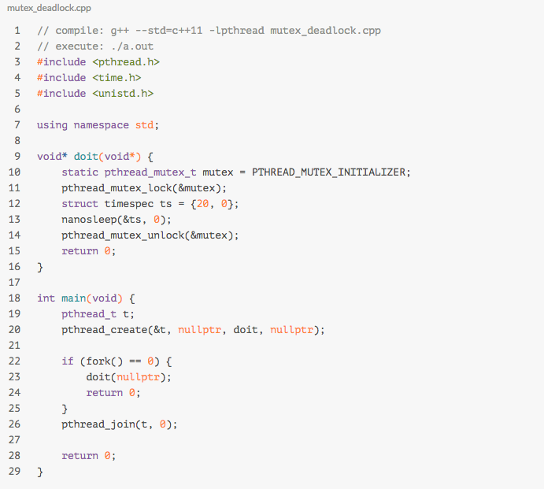

# linux进程管理

[Linux 进程管理剖析](https://www.ibm.com/developerworks/cn/linux/l-linux-process-management/index.html)

## 进程

#### Linux进程的概念

《linux内核设计与实现》的描述：

进程就是处于执行期的程序（目标代码存放在某种介质上）。但进程并不仅仅局限于一段可执行的代码。通常进程还包含其他资源，像打开的文件，挂起的信号，内核内部数据，处理器状态，一个或多个具有内存映射内存地址空间及一个或多个执行线程，当然还包括用来存放全局变量的数据段等。

#### Linux线程

> 从内核来讲，并没有线程的概念，**linux把线程当做进程来实现**。内核并没有特殊的调度算法或者定义特别的数据结构来表征线程。线程仅被看做一个与其它进程共享某些资源的进程。每个线程都拥有唯一属于自己的task_struct,所以在内核中，它看起来像是一个普通的进程（只是它和其他一些进程共享某些资源），只是它没有自己独立的内存地址空间。

[linux线程实现机制](https://blog.csdn.net/HandsomeHong/article/details/73928873)

> 线程的发展史：
>
> posix对线程提出了5个要求，posix是不关心每个系统怎么实现的，只要实现要求就行，类似协议规范；
>
> - 系统必须能够响应终止信号并杀死整个进程。
> - 以堆栈形式使用的内存回收必须在线程完成之后进行。因此，线程无法自行完成这个过程。
> - 终止线程必须进行等待，这样它们才不会进入僵尸状态。
> - 线程本地数据的回收需要对所有线程进行遍历；这必须由管理线程来进行。
> - 如果主线程需要调用 `pthread_exit()`，那么这个线程就无法结束。主线程要进入睡眠状态，而管理线程的工作就是在所有线程都被杀死之后来唤醒这个主线程。
>
> 第一次实现的Linux Thread库，多个线程分成一组，其中多一个管理线程。Linux thread库只实现的第五个要求；
>
> NTPL（Native POSIX Thread Library）实现了上面的所有的要求，线程和进程的比例是1:1
>
> NGPT 实现了进程与线程M:N的模型，但是这种实现再2003年已经停用；
>
> NTPL的主要优点：（主要针对于linux线程库）
>
> - 取消的管理线程，管理线程的一部分功能由linux kernel已经实现了。因为没有了管理线程，因此线程模型在NUMA和SMP系统上具有更好的可伸缩性和同步机制；
> - 在ntpl中所有线程都有一个父进程，因此对父进程汇报资源使用情况即可，而不用每一个线程进行统计。
> - linux通过futex的
>
> [Linux Futex设计和实现](https://blog.csdn.net/jianchaolv/article/details/7544316)
>
> Futex是一种用户态和内核态混合的同步机制。首先，同步的进程间通过mmap共享一段内存，futex变量就位于这段共享 的内存中且操作是原子的，当进程尝试进入互斥区或者退出互斥区的时候，先去查看共享内存中的futex变量，如果没有竞争发生，则只修改futex,而不 用再执行系统调用了。当通过访问futex变量告诉进程有竞争发生，则还是得执行系统调用去完成相应的处理(wait 或者 wake up)。简单的说，futex就是通过在用户态的检查，（motivation）如果了解到没有竞争就不用陷入内核了，大大提高了low-contention时候的效率。 Linux从2.5.7开始支持Futex。
>
>

### 上下文切换

[上下文切换时堆栈的切换](http://freemandealer.github.io/2015/07/14/context-switch/)

> 一般指用户上下文与内核上下文的之间切换。内核上下文又分为中断/异常上下文、系统调用上下文 —— 区别是后者可以从用户空间使用`INT`指令陷入(即门描述符特权级别为DPL_USER)。上下文切换就是: 1)暂停执行、2) 保护现场、3) 恢复现场、4) 恢复执行的过程。这里的现场只CPU现场，就是各个寄存器以及标志位的状态。

> 特别需要注意的是，中断和调度器逻辑不属于任何进程(它们也不是进程，它们只是一段在某个时间内会被CPU执行的代码，一般被称作控制流或执行流）。中断响应硬件事件，与进程是并行的概念。调度器是管理进程的，概念上就比进程高一个层次。那么问题来了：这两个控制流运行时使用的是哪里的堆栈？中断借用当前进程(Linux的current或xv6的proc)的内核栈。调度器使用自己独立的内核堆栈。同时因为每个CPU都有一个自己的调度器，所以调度器的堆栈在系统中有多个，是per-CPU结构。

**进程切换**

- 把进程（old）的寄存器压栈
- 切换到调度器堆栈
- 弹出调度寄存器现场
- 运行调度器
- 暂停调度器将调度器寄存器压栈
- 弹出next寄存器现场
- 运行next
- GOTO BEGINNING

**中断切换**

中断发生时cpu可能处于内核态（不涉及特权切换），也可能处于用户态（涉及特权切换）

对不涉及特权切换的，中断处理程序可以借助内核的栈。（实际在现在的linux的实现中，中断处理程序有自己的中断栈）

对于不涉及特权切换到情况那么，2，3，4步，涉及用户态的那么全部步骤都涉及。

- 1. 根据TSS找到内核栈

- 1. 压入寄存器现场，错误代码

- 1. 转入中断处理程序

- 1. 恢复第二步保存的现场

- 1. 切换回用户栈

#### 进程调度策略

linux支持SHCED_FIFO和SCHED_RR两种实时调度策略，

*linux何时使用CFS策略，何时使用FIFO和RR策略？*

linux进程分为3类： 

| 类型                            | 描述                                                         | 分类                                                         |
| ------------------------------- | ------------------------------------------------------------ | ------------------------------------------------------------ |
| 交互式进程(interactive process) | 此类进程经常与用户进行交互, 因此需要花费很多时间等待键盘和鼠标操作. 当接受了用户的输入后, 进程必须很快被唤醒, 否则用户会感觉系统反应迟钝 | shell, 文本编辑程序和图形应用程序                            |
| 批处理进程(batch process)       | 此类进程不必与用户交互, 因此经常在后台运行. 因为这样的进程不必很快相应, 因此常受到调度程序的怠慢 | 程序语言的编译程序, 数据库搜索引擎以及科学计算               |
| 实时进程(real-time process)     | 这些进程由很强的调度需要, 这样的进程绝不会被低优先级的进程阻塞. 并且他们的响应时间要尽可能的短 | 视频，音频应用程序，机器人控制程序以及物理传感器上收集数据的程序。 |

对于前两者，算是普通进程，linux使用cfs调度；对于实时进程，使用实时算法FIFO Robin； （todo: 至于kernel怎样把两种算法一起调度的，以及采用怎样的数据结构，这些细节暂不研究）

各种调度算法的调度优先级别：

> stop_sched_class -> dl_sched_class -> rt_sched_class -> fair_sched_class -> idle_sched_class

**触发进程休眠的事件**

- 从文件IO读更多的数据
- 某个硬件事件
- 尝试获取一个已经被占用的内核信号量

那么此时kernel做什么呢？

- 进程把自己标记成休眠状态，从可执行的红黑中移出，放入等待队列；（这个等待队列是由链表组成的）
- 调用一次schedule(),选择和执行另外一个进程；

**唤醒**

	通过函数wake_up()进行，它会唤醒指定的等待队列上的所有进程；

    	这里可以得出：因为不懂原因导致休眠的进程是放在不同的等待队列中的；

**什么样的情况下会发生用户抢占**

用户抢占式以下的情况下发生的：

- 从系统调用返回用户空间时
- 从中断处理程序返回用户空间时

为什么是上面两种，是否还有其他的场景导致用户抢占；

linux是支持**`内核抢占`**的，但这里不详细展开；

## 中断和中断处理

**如何理解中断和异常**

- 中断使得硬件发出通知给CPU，不同的硬件中断对应的中断处理号不一样；
- 异常也称为同步中断；（因为它的处理方式跟中断非常像，逻辑上可认为是中断的一种）

**异常是如何产生的**

在cpu执行到由于编程失误而导致的错误指令，或者执行期间出现特殊情况（如缺页），必须由内核处理的时候，cpu就产生一个异常；

**中断处理程序**

- Linux就是普通的C函数，只不过需要按照特定的类型声明，以便以标准的方式传递程序处理信息；
- 它的不同在于，中断处理程序运行在中断上下文中。

中断上下文中是不可以嵌套，不可以调用导致睡眠的函数（无法唤醒）， 中断处理程序分为上半部和下半部，至于哪些在上半部完成，哪些在下半部完成，参看：

[中断下半部的三种机制](https://blog.csdn.net/freeelinux/article/details/54266843)

## 系统调用

[硬中断与软中断的区别](http://blog.51cto.com/noican/1361087)

> 系统调用中用到的底层原理就是软中断，看上面软中断和硬中断的区别； 软中断不能中断cpu，而且只能在当前正在运行的程序中产生；

软中断是一种需要内核为正在运行的进程去做一些事情（通常为I/O）的请求。有一个特殊的软中断是Yield调用，它的作用是请求内核调度器去查看是否有一些其他的进程可以运行。

注意上面的话： 

- 软中断一般不会引起进程调度的切换，可能只是cpu/寄存器的切换；Yield是可以一起进程切换的； 系统调用有自己的栈页。

**系统调用的上下文**

系统调用的上下文是处于中断进程的上下文中

**系统调用返回**

参数个数为N的系统调用由_syscallN()负责格式转换和参数传递。系统调用号放入EAX寄存器，启动INT 0x80后，规定返回值送EAX寄存器。

> 为防止和正常的返回值混淆，系统调用并不直接返回错误码，而是将错误码放入一个名为errno的全局变量中。通常用一个负的返回值来表明错误。返回一个0值通常表明成功。

## 内核同步

**并发执行是怎样造成的**

1. 真并发，多个处理器可以同时处理临界区域的数据；
2. 伪并发，单核多线程中，一个线程处于临界区时，可以随时被非自愿的抢占；如果抢占程序（比如信号处理程序）也操作了这块临界区域，那么同样会形成竞争条件。

**内核中存在的抢占**

1. 中断
2. 软中断和tasklet
3. 内核抢占（比如CFS进程执行切换）
4. 睡眠及用户空间同步
5. 对称多处理 => 两个或者多个处理器同时处理代码可以同时执行代码

**锁的粒度多大才合适**

1. 过大： 比如一个大的链表的数据结构，如果只用一个锁，争用会非常厉害，导致性能降低；
2. 过小： 每一个链表节点都搞一个锁，在大规模的SMP机器上执行的很好。但在双核处理器上，争用不明显，白白增加系统开销；

## 内核同步方法

**原子操作**

注意“原子性”跟“顺序性”的差异，原子操作只保证原子性，顺序性通过”屏障“（barrier)指令来实施。

**自旋锁**

如果一个执行线程试图获得一个已经被持有的自旋锁，那么该线程就一直忙循环，等待锁重新可用。 -> 设计的初衷是短时间内进行轻量级的加锁。

- 与之对应的是唤醒锁。让请求线程睡眠，直到锁重新可用时再唤醒它。优点就是处理器不用等待，可以去执行其它代码，负面作用是这里有明显的两次上下文切换，被阻塞的线程要换出和换入。
- 在中断处理程序中使用spin_lock时，一定要先禁止中断。spin_lock是非递归的。
- 持有自旋锁是不允许睡眠的。

**信号量**

> Linux中的信号量是一种睡眠锁。如果有任务试图获取一个不可用（已经被占用）的信号量时，信号量会将其推进一个等待队列，然后让其睡眠。这时处理器重获自由，从而去执行其他代码。当持有的信号量可用后，处于等待队列中的那个任务呗唤醒，并获得该信号量。

等待队列中任务的是指什么，进程？

-> 防止每次都睡眠

**二值信号量**

在同一个时刻仅允许有一个锁持有者，这时的计数等于1。

**多值信号量**

它允许在一个时刻至多有count个锁持有者，计数信号量不能用来进行强制互斥，因为它允许多个线程同时访问临界区。

*一般用来做任务对列时使用*

**读写信号量**

**互斥体**

也就是我们常用的锁；一种更简单的睡眠锁；（todo: 简单具体体现在哪里，难道只是外在的使用上，还是内在的实现上?)

一些特性：

- 给mutex上锁者必须负责再给其解锁；不能在一个上下文中上锁，而在另一个上下文中解锁；
- 不能递归的上锁和解锁；（外面的递归锁的实现是又加了一层封装）
- 当持有一个mutex，进程不能退出（是否能够pthread_create?)
- mutex不能在中断或者下半部中使用，即使使用mutex_trylock()也不行。（这一点应该是上面第一点的推论）

## fork与锁安全

[程序员的自我修养（三）：fork() 安全](https://liam0205.me/2017/01/17/fork-safe/)

[极不和谐的 fork 多线程程序](https://blog.codingnow.com/2011/01/fork_multi_thread.html)

**fork后都继承了什么？**

1. fork只继承了父进程所在的线程，其他的线程没有继承；
2. 子进程复制了父进程完成的虚拟空间。包括：互斥锁，条件变量，线程内部的对象等，因为这些对象的状态也放在内存中，所以这些对象的状态也被继承过来了。

以后所有的行为都可以通过以上两点推导出来

**子进程为什么会陷入到死锁中？**

1. 父进程在fork之前有两个线程，主线程和子线程，子线程持有一个锁（mutex）。
2. 子进程是从主线程中继承过来的，只有一个线程。子进程同时继承了mutex，这个mutex是一块新的内存对象，可认为mutex2, 而且mutex2的状态是锁定状态。
3. 子进程尝试对mutex2锁定，陷入到死锁当中。(而且子进程感知不到这个锁的状态，上来就unlock一把，看起来就奇葩。子进程只有知道mutex的lock才能进行操作 -> pthread_atfork()的实现)

**如何解决上面的问题？**

1. pthread_atfork()
2. fork完毕之后立即执行exec

> 在多线程程序里使用fork是比较郁闷的事情； 不只是应用层的锁的问题； 很多C库里的函数调用也会出现死锁线程； 最好的办法是在多线程进程里不是用fork； 如果非使用不可，尽量fork完毕后直接exec，不调用任何其他除了fork之外的函数； exec可以覆盖内存空间，可以解决所有关于锁的问题

