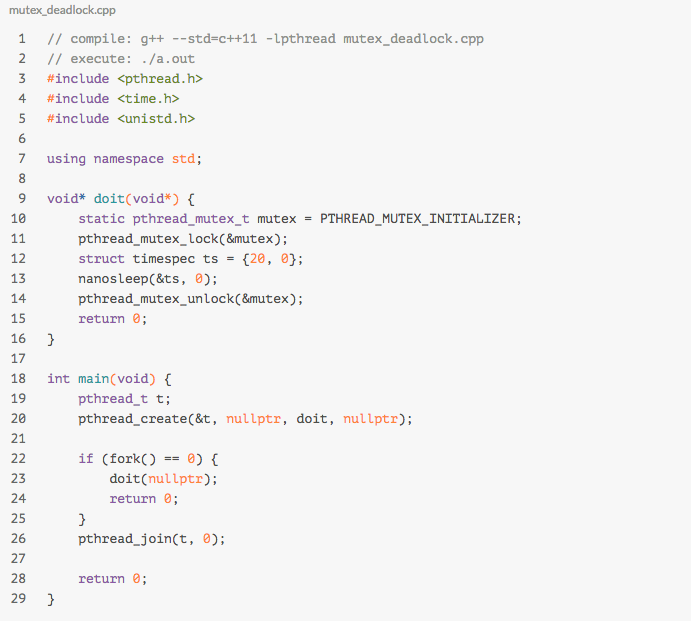

# linux内存管理

## Linux虚拟地址空间布局


参考： [Linux虚拟地址空间布局](http://www.cnblogs.com/clover-toeic/p/3754433.html)

## Linux虚拟地址到物理地址的映射（页表）

1. linux如何完成虚拟地址到物理地址的映射

- ***为什么不使用数组来维护映射？***

     IA-32单个页面4KB，虚拟地址空间：4GB。内存地址总的页面数 4GB/4KB = (4 * 2**30) / (4 * 2*20) = 1024 * 1024；也即: int pagetable[1024 * 1024], 数组的总大小为4MB；

     更大头的问题是每个进程的这4MB空间是必须物理内存连续的！如果有1000个进程，那么4GB的连续空间，操作系统也就什么事都干不了！


- ***80386中2级页表***

  地址空间： 

  | 地址      | 单元     |                 |      |
  | --------- | -------- | --------------- | ---- |
  | 高10bit   | 页目录表 | 1024 page dir   |      |
  | 中间10bit | table表  | 1024 page table |      |
  | 低12bit   | 页内偏移 | 4096 offset     |      |

  所需内存： （1024 * 1024）* 4 = 4MB, 需要的地址空间没有变；但是有两点改进具备现实性

  - 所需要的内存不需要连续，即便页目录表也采用数组的方式4 * 1024 = 1page; （真实的实现中应该不是采用数组映射，看第二点）
  - Kernel只会为proccess用到的内存进行映射，没有用到的不映射；这才是大幅缩减使用内存的方案；

- linux中的分页

- http://blog.csdn.net/gatieme/article/details/52402861

​    分成独立层(体系结构无关)/依赖层(体系结构相关)两个层次；

​    


## GLIBC malloc 实现分析

## TCMallco 实现分析

[图解TCMalloc](https://zhuanlan.zhihu.com/p/29216091) golang中自己实现一套tcmalloc的实现；


5. 


# linux文件管理

## 虚拟文件系统

[linux文件系统详解](https://blog.csdn.net/freeking101/article/details/78223455)


查看系统调用表：

[linux系统调用表](https://blog.csdn.net/sinat_26227857/article/details/44244433)


fd -> struct *file -> inode -> 文件实体

1. 通过fd是如何找到struct *file的？

   - 没有运行的进程都保持一个struct *file 的数组，fd就是这个数组的下标，即通过fd可以直接寻址struct *file;

   

2. 通过struct *file如何找到这个文件的inode？

​    函数调用中是在open的时候，就放到struct *file, 中间的调用层次很深；要查找的数据结构是在内核中的，不是属于某一个进程；

了解了以上两点：

1. 写操作是系统调用，由内核负责的原子操作，所以不会出现相互交叉的情况，比如“AAAA", "BBBB", 写入的文件不会出现”AABBAABB"的情况，但是写是可以相互覆盖的；

1. 两个不同的fd指向同一个文件（不同进程打开）

- write的时候如果存在lseek操作，可能写之间会相互覆盖。
- 如果要避免上述情况的发生，则采用O_APPEND的方式

1. 同一个进程，多线程使用同一个fd

   只有一个文件表项，也就是只有一个文件偏移量，如果不需要调用lseek()后再调用read()/write()，那么并没有数据冲突的危险; 如果存在lseek的情况，同情况1；

   ​

## 页高速缓存和页回写

如何设计这样的缓存？

**缓存的时机是什么**

缓存 -> 磁盘

有三种解决方案：

- 不做缓存，直接写入磁盘。这样效率无疑是非常低的。
- 写透缓存。自动更新内存缓存，同时更新磁盘文件。
- 回写。更新缓存，并把页面标记为脏，加入到脏页链表当中，然后由一个进程周期性写回到磁盘中。（读的时候，直接降其读出来就行了）

**缓存的退出机制是怎样的**

- 最近最少使用（已经不错了，还是有缺陷，比如有的人只加载了一次就不用了）
- 双链策略；（活跃缓存和非活跃缓存，向上面那种情况，只有一次放入到非活跃链表中）


## mmap

参考：

[认真分析mmap：是什么 为什么 怎么用](http://www.cnblogs.com/huxiao-tee/p/4660352.html)

**mmap是干什么的**

mmap是一中内存映射文件的方法，即将一个文件或者其它对象映射到进程空间，实现文件磁盘地址和进程虚拟地址空间一一映射的关系。


**kernel 映射过程**

- 当前进程的地址空间中，寻找一段空闲的，满足要求的虚拟区。

- 分配一个vm_area_struct来描述和管理这段内存区域，并vm_area_struct插入到进程的虚拟地址区域链表或者树中。

- 使用下面的函数，把“文件”和”内存“关联起来

  > int mmap(struct file *filp, struct vm_area_struct *vma)

  注意这个时候，虚拟地址并没有任何数据关联到主存中。实际上“物理磁盘” -> "内存"过程还是按需缓存的。

- 进程发起对这篇映射空间的访问，引发缺页异常，实现文件内容到物理内存的拷贝；

  a)进程读写这一段区域 -> 查询页表（没有） -> 缺页异常。b)在swap cache中寻找（没有)-> nopage -> 从磁盘装入到主存中。

**与常规文件操作有何优点？**

- 常规文件操作需要从`磁盘操作`->`页缓存`->`用户主存` 两次数据拷贝。而mmap只要`磁盘操作`->`页缓存`两步操作。
- 提供进程间共享内存及相互通信的方式。对于父子进程或者亲缘进程，由于可以感知到彼此的虚拟内存区域，都可以将自身用户空间映射到同一个文件或者匿名映射到同一片区域。

**评论**

1. linux是否称文件描述符比“句柄”更佳。
2. mmap之所以快，是因为建立了页到用户进程的虚地址空间映射，以读取文件为例，避免了页从内核态拷贝到用户态。
3. 除第2点之外，mmap映射的页和其它的页并没有本质的不同。
   所以得益于主要的3种数据结构的高效，其页映射过程也很高效：
   (1) radix tree，用于查找某页是否已在缓存.
   (2) red black tree ，用于查找和更新vma结构。
   (3) 双向链表，用于维护active和inactive链表，支持LRU类算法进行内存回收。
4. mmap不是银弹
   (1) 对变长文件不适合。
   (2) 如果更新文件的操作很多，mmap避免两态拷贝的优势就被摊还，最终还是落在了大量的脏页回写及由此引发的随机IO上。

所以在随机写很多的情况下，mmap方式在效率上不一定会比带缓冲区的一般写快。

1. 之前接触的mongodb版本无法控制对内存的使用，所以当数据比较大时，其内存使用难以控制，一切的内存 -> 页 -> swap 步骤都交给了操作系统，难以进行有效调优。频繁的页swap会让mongodb的优势荡然无从。


# linux进程管理

## 进程调度

**进入休眠的事件**

- 从文件IO读更多的数据
- 某个硬件事件
- 尝试获取一个已经被占用的内核信号量

**kernel做什么**

- 进程把自己标记成休眠状态，从可执行的红黑中移出，放入等待队列；（这个等待队列是由链表组成的）
- 调用一次schedule(),选择和执行另外一个进程；

**唤醒**

通过函数wake_up()进行，它会唤醒指定的等待队列上的所有进程；

​    这里可以得出：因为不懂原因导致休眠的进程是放在不同的等待队列中的；

**上下文切换**

当切换运行的进程时，发生上下文切换；做两件事：

- 把虚拟内存映射切换到新进程中；
- 切换处理器执行相关的周边状态： 保存，恢复栈信息和寄存器信息，还有其他任何与体系结构相关的状态信息； （todo: 如何理解这个体系结构）

**用户抢占**

用户抢占式以下的情况下发生的：

- 从系统调用返回用户空间时
- 从中断处理程序返回用户空间时

为什么是上面两种，是否还有其他的场景导致用户抢占；

linux是支持**`内核抢占`**的，但这里不详细展开；


**实时调度策略**

linux支持SHCED_FIFO和SCHED_RR两种实时调度策略，

*linux何时使用CFS策略，何时使用FIFO和RR策略？*

linux进程分为3类： 

| 类型                            | 描述                                                         | 分类                                                         |
| ------------------------------- | ------------------------------------------------------------ | ------------------------------------------------------------ |
| 交互式进程(interactive process) | 此类进程经常与用户进行交互, 因此需要花费很多时间等待键盘和鼠标操作. 当接受了用户的输入后, 进程必须很快被唤醒, 否则用户会感觉系统反应迟钝 | shell, 文本编辑程序和图形应用程序                            |
| 批处理进程(batch process)       | 此类进程不必与用户交互, 因此经常在后台运行. 因为这样的进程不必很快相应, 因此常受到调度程序的怠慢 | 程序语言的编译程序, 数据库搜索引擎以及科学计算               |
| 实时进程(real-time process)     | 这些进程由很强的调度需要, 这样的进程绝不会被低优先级的进程阻塞. 并且他们的响应时间要尽可能的短 | 视频，音频应用程序，机器人控制程序以及物理传感器上收集数据的程序。 |


对于前两者，算是普通进程，linux使用cfs调度；对于实时进程，使用实时算法FIFO Robin； （todo: 至于kernel怎样把两种算法一起调度的，以及采用怎样的数据结构，这些细节暂不研究）

各种调度算法的调度优先级别：

> stop_sched_class -> dl_sched_class -> rt_sched_class -> fair_sched_class -> idle_sched_class


## 系统调用

[硬中断与软中断的区别](http://blog.51cto.com/noican/1361087)

> 系统调用中用到的底层原理就是软中断，看上面软中断和硬中断的区别； 软中断不能中断cpu，而且只能在当前正在运行的程序中产生；

软中断是一种需要内核为正在运行的进程去做一些事情（通常为I/O）的请求。有一个特殊的软中断是Yield调用，它的作用是请求内核调度器去查看是否有一些其他的进程可以运行。

注意上面的话： 

- 软中断一般不会引起进程调度的切换，可能只是cpu/寄存器的切换；Yield是可以一起进程切换的； 

**系统调用的上下文**

系统调用的上下文是处于中断进程的上下文中

**系统调用返回**

参数个数为N的系统调用由_syscallN()负责格式转换和参数传递。系统调用号放入EAX寄存器，启动INT 0x80后，规定返回值送EAX寄存器。

> 为防止和正常的返回值混淆，系统调用并不直接返回错误码，而是将错误码放入一个名为errno的全局变量中。通常用一个负的返回值来表明错误。返回一个0值通常表明成功。


## 中断和中断处理

**如何理解中断和异常**

- 中断使得硬件发出通知给CPU，不同的硬件中断对应的中断处理号不一样；
- 异常也称为同步中断；（因为它的处理方式跟中断非常像，逻辑上可认为是中断的一种）

**异常是如何产生的**

在cpu执行到由于编程失误而导致的错误指令，或者执行期间出现特殊情况（如缺页），必须由内核处理的时候，cpu就产生一个异常；


**中断处理程序**

- Linux就是普通的C函数，只不过需要按照特定的类型声明，以便以标准的方式传递程序处理信息；
- 它的不同在于，中断处理程序运行在中断上下文中。

中断上下文中是不可以嵌套，不可以调用导致睡眠的函数（无法唤醒）

**中断上半步**

1. 上半步只执行有严格时限的工作，如应答和复位硬件，把网卡中的数据转到系统内存。

**中断下半部**


## 内核同步

**并发执行是怎样造成的**

1. 真并发，多个处理器可以同时处理临界区域的数据；
2. 伪并发，单核多线程中，一个线程处于临界区时，可以随时被非自愿的抢占；如果抢占程序（比如信号处理程序）也操作了这块临界区域，那么同样会形成竞争条件。

**内核中存在的抢占**

1. 中断
2. 软中断和tasklet
3. 内核抢占（比如CFS进程执行切换）
4. 睡眠及用户空间同步
5. 对称多处理 => 两个或者多个处理器同时处理代码可以同时执行代码

**锁的粒度多大才合适**

1. 过大： 比如一个大的链表的数据结构，如果只用一个锁，争用会非常厉害，导致性能降低；
2. 过小： 每一个链表节点都搞一个锁，在大规模的SMP机器上执行的很好。但在双核处理器上，争用不明显，白白增加系统开销；


## 内核同步方法

**原子操作**

注意“原子性”跟“顺序性”的差异，原子操作只保证原子性，顺序性通过”屏障“（barrier)指令来实施。

**自旋锁**

如果一个执行线程试图获得一个已经被持有的自旋锁，那么该线程就一直忙循环，等待锁重新可用。 -> 设计的初衷是短时间内进行轻量级的加锁。

- 与之对应的是唤醒锁。让请求线程睡眠，直到锁重新可用时再唤醒它。优点就是处理器不用等待，可以去执行其它代码，负面作用是这里有明显的两次上下文切换，被阻塞的线程要换出和换入。
- 在中断处理程序中使用spin_lock时，一定要先禁止中断。spin_lock是非递归的。
- 持有自旋锁是不允许睡眠的。

**信号量**

>  Linux中的信号量是一种睡眠锁。如果有任务试图获取一个不可用（已经被占用）的信号量时，信号量会将其推进一个等待队列，然后让其睡眠。这时处理器重获自由，从而去执行其他代码。当持有的信号量可用后，处于等待队列中的那个任务呗唤醒，并获得该信号量。

等待队列中任务的是指什么，进程？

-> 防止每次都睡眠

**二值信号量**

在同一个时刻仅允许有一个锁持有者，这时的计数等于1。

**多值信号量**

它允许在一个时刻至多有count个锁持有者，计数信号量不能用来进行强制互斥，因为它允许多个线程同时访问临界区。

*一般用来做任务对列时使用*

**读写信号量**

**互斥体**

也就是我们常用的锁；一种更简单的睡眠锁；（todo: 简单具体体现在哪里，难道只是外在的使用上，还是内在的实现上?)

一些特性：

- 给mutex上锁者必须负责再给其解锁；不能在一个上下文中上锁，而在另一个上下文中解锁；
- 不能递归的上锁和解锁；（外面的递归锁的实现是又加了一层封装）
- 当持有一个mutex，进程不能退出（是否能够pthread_create?)
- mutex不能在中断或者下半部中使用，即使使用mutex_trylock()也不行。（这一点应该是上面第一点的推论）


## fork与锁安全

[程序员的自我修养（三）：fork() 安全](https://liam0205.me/2017/01/17/fork-safe/)

[极不和谐的 fork 多线程程序](https://blog.codingnow.com/2011/01/fork_multi_thread.html)




**fork后都继承了什么？**

1. fork只继承了父进程所在的线程，其他的线程没有继承；
2. 子进程复制了父进程完成的虚拟空间。包括：互斥锁，条件变量，线程内部的对象等，因为这些对象的状态也放在内存中，所以这些对象的状态也被继承过来了。

以后所有的行为都可以通过以上两点推导出来

**子进程为什么会陷入到死锁中？**

1. 父进程在fork之前有两个线程，主线程和子线程，子线程持有一个锁（mutex）。
2. 子进程是从主线程中继承过来的，只有一个线程。子进程同时继承了mutex，这个mutex是一块新的内存对象，可认为mutex2, 而且mutex2的状态是锁定状态。
3. 子进程尝试对mutex2锁定，陷入到死锁当中。(而且子进程感知不到这个锁的状态，上来就unlock一把，看起来就奇葩。子进程只有知道mutex的lock才能进行操作 -> pthread_atfork()的实现)

**如何解决上面的问题？**

1. pthread_atfork()
2. fork完毕之后立即执行exec

>在多线程程序里使用fork是比较郁闷的事情； 不只是应用层的锁的问题； 很多C库里的函数调用也会出现死锁线程； 最好的办法是在多线程进程里不是用fork； 如果非使用不可，尽量fork完毕后直接exec，不调用任何其他除了fork之外的函数； exec可以覆盖内存空间，可以解决所有关于锁的问题


# linux定时管理

## 定时器与时间管理

**内核中的时间概念**

内核必须在硬件的帮助下才能计算和管理时间。系统定时器以某种频率自行触发时钟中断，该中断可以通过编程设定，称为节拍率（tick rate).


linux2.5之前的节拍率是100， 2.5之后就变成1000了。即每个1ms产生一个时钟中断，那么时钟中断产生后，kernel做些神马事呢？（这个中断是谁产生的，看下面的RTC部分）

- 更新系统时间
- 更新实际时间
- 在smp系统上，均衡调度程序中各处理器上的运行队列
- 检查当前进程是否用尽了自己的时间片，如果用尽，重新进行调度。
- 运行超时的动态定时器
- 更新资源消耗和处理器时间统计值。

> 如何理解 usleep(10) 这种需求呢，难道每次变成睡眠1ms吗？即系统中微秒级别的定时器是如何实现的?
>
> [High-resolution timing](http://tldp.org/HOWTO/IO-Port-Programming-4.html)
>
> - sleep级别的
>
> sleep usleep 使用的进程级别切换，只能维持10ms级别的准确度；
>
> 现在usleep是使用unsleep实现的，unsleep有改进 -> 前提是设置了`sched_setscheduler()`
>
> In the 2.0.x series of Linux kernels, there is a new system call, `nanosleep()` (see the `nanosleep(2)` manual page), that allows you to sleep or delay for short times (a few microseconds or more).
>
> For delays <= 2 ms, if (and only if) your process is set to soft real time scheduling (using `sched_setscheduler()`), `nanosleep()` uses a busy loop; otherwise it sleeps, just like `usleep()`.
>
> 
>
> - 使用中断来实现实现定时器
>
>   Inputting or outputting any byte from/to port 0x80 (see above for how to do it) should wait for almost exactly 1 microsecond independent of your processor type and speed.
>
> - 使用汇编指令来实现时钟级别的定时器
>
> ```
> Instruction   i386 clock cycles   i486 clock cycles
> xchg %bx,%bx          3                   3
> nop                   3                   1
> or %ax,%ax            2                   1
> mov %ax,%ax           2                   1
> add %ax,0             2                   1
> ```

[时钟和定时器电路](http://guojing.me/linux-kernel-architecture/posts/time-system/)

- 实时时钟  RTC 

  >独立于时间CPU和其他芯片，即使当PC被切断电源，RTC依旧继续工作，因为它靠一个小电池或蓄电池供电。CMOS TAM和RTC被继承在一个芯片[1](http://guojing.me/linux-kernel-architecture/posts/time-system/#fn:1)上。
  >
  > 
  >
  >RTC能在IRQ8上发出周期性的中断，频率在2～8192Hz之间，也可以对RTC进行编程以使当RTC到达某个特定的值时激活IRQ8线，也就是作为一个闹钟来工作。

  

- 时间戳计时器 TSC gettimeofday就是从TSC中获取的，所以可以统计很短的时间流逝。

  >所有的80x86微处理器都包含一条CLK输入引线，它接收玩不振荡器的时钟信号。从Pentium开始，80x86微处理器就都包含一个计数器，它在每个时钟信号到来时加1。该计数器是利用64位的时间戳计数器（*Time Stamp Counter TSC*）寄存器来实现的，可以通过汇编语言指令*rdtsc*来读这个寄存器。当使用这个寄存器时，内核必须考虑到时钟信号的频率，例如时钟节拍的频率时1GHz，那么时间戳计数器每那庙增加一次。

- PIT Programmable Interval Timer

- CPU本地计时器